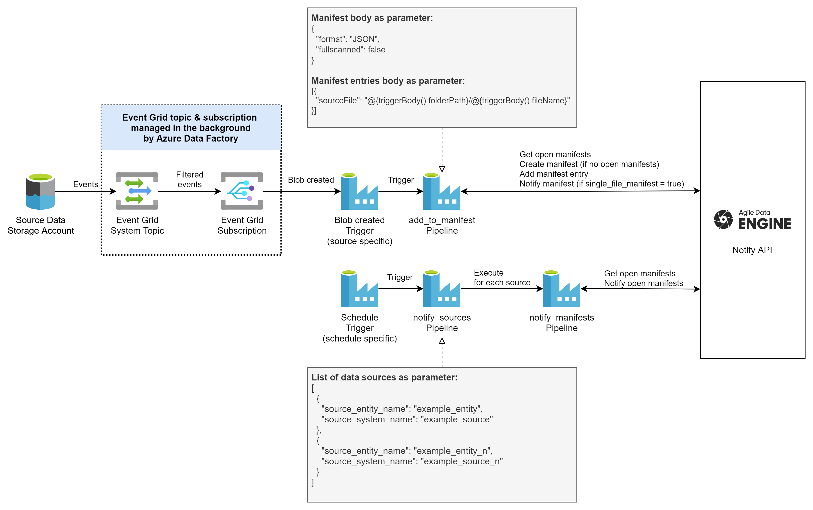

# Introduction
This repository contains a reference solution for notifying incoming source data files for Agile Data Engine Notify API (https://docs.agiledataengine.com/docs/notify-api-saas) with Azure Data Factory (ADF).

**The repository is provided for reference purposes only and the solution may require modifications to fit your use case. Note that this solution is not part of the Agile Data Engine product. Please use at your own caution.**

Note that a general recommendation is to use the Azure Functions based notifier maintained in the [ade-notify-api-reference-azure](https://github.com/solita/ade-notify-api-reference-azure) repository instead of this ADF notifier. The Functions based notifier offers more configurability and generally better performance especially if you have lots of data sources with source files landing frequently. However, if you are already using Azure Data Factory for source data extraction and you are well familiar with it, the ADF notifier could be a good option to get started with.

**Contents:**
- ADF pipeline templates (.zip files)

# Process

The solution contains the following Azure Data Factory pipelines:
- add_entry_to_manifest
- add_entries_to_manifest
- notify_sources
- notify_manifests

By default, the process is as follows:

1. Source data files are created into a Storage Account Blob Container by an external process (i.e. not Agile Data Engine nor the Notifier). This source data storage account is not part of the Notifier solution and must be managed separately.
2. A data source specific [storage event trigger](https://docs.microsoft.com/en-us/azure/data-factory/how-to-create-event-trigger?tabs=data-factory) is created in ADF that triggers the **add_entry_to_manifest** pipeline whenever new source data files land in the defined path. Various parameters can be set in the trigger to manage manifest creation for the data source (see the **Parameters** section below).
3. The **add_entry_to_manifest** pipeline searches for open manifests, creates a new one if needed, and adds a file url as entry. If the **notify_manifest** parameter is set to **true**, the pipeline also notifies the manifest once the entry is added.
4. Open manifests are notified (closed) on schedule by the **notify_sources** and **notify_manifests** pipelines. Create triggers with different schedules as needed to trigger notifying of open manifests of sources listed as parameter.

Note that alternatively the pipelines can be called from other pipelines or by any external process. You can use the **add_entries_to_manifest** pipeline with external processes to simply:

1. Create a manifest.
2. Add multiple entries to the manifest with one request.
3. Notify the manifest.

# Prerequisites
- Follow [Microsoft documentation](https://docs.microsoft.com/en-us/azure/data-factory/) to create and configure an Azure Data Factory or use an existing one.
- Configure a [self-hosted integration runtime](https://docs.microsoft.com/en-us/azure/data-factory/create-self-hosted-integration-runtime?tabs=data-factory) that is hosted on a server with a static public outbound IP address (or address range). Provide the IP addresses to the Agile Data Engine support team so they can be allowed. Notify API blocks requests from unknown addresses.
- Configure a Key Vault as a [linked service](https://docs.microsoft.com/en-us/azure/data-factory/store-credentials-in-key-vault) to the Data Factory if one is not already configured. Add a secret with name **notify-api-key-secret** into the Key Vault. Set the value as the Notify API key secret you have received from Agile Data Engine support.

# Deployment
1. Open Azure Data Factory Studio.
2. In the Author menu, click Add new resource - Pipeline - Import from pipeline template.
3. Add pipeline template files:
    - [add_entry_to_manifest.zip](./add_entry_to_manifest.zip)
    - [add_entries_to_manifest.zip](./add_entries_to_manifest.zip)
    - [notify_sources.zip](./notify_sources.zip)
    - [(notify_manifests.zip)](./notify_manifests.zip)

**Note that importing the notify_sources pipeline also imports its dependency pipeline notify_manifests.**

Select the Key Vault where you have stored notify-api-key-secret as the linked service.

# Configuration
## Integration runtime
Edit the settings of each **Web activity** to use the self-hosted integration runtime mentioned in the prerequisites. 

## Pipeline parameters
### add_entry_to_manifest
| Parameter  | Example value | Description |
| --- | --- | --- |
| notify_api_base_url | https://external-api.dev.datahub.s1234567.saas.agiledataengine.com/notify-api | Agile Data Engine tenant & environment specific Notify API base url. |
| notify_api_key | e8cbca20-0d78-11ed-861d-0242ac120002 | Environment specific Notify API key. Note that the pipelines fetch the Notify API key secret (notify-api-key-secret) from Key Vault. |
| source_system_name | example_source | Source system name defined in the source entity, see [Agile Data Engine documentation](https://docs.agiledataengine.com/docs/notify-api-saas). |
| source_entity_name | example_entity | Source entity name, see [Agile Data Engine documentation](https://docs.agiledataengine.com/docs/notify-api-saas). |
| manifest_body | { "format": "CSV", "delim": "COMMA", "skiph": 1 } | Request body in the [create manifest](https://docs.agiledataengine.com/docs/create-manifest-post) API call. Default value is *{}*, i.e. optionally you can leave this unset and configure [file format options](https://docs.agiledataengine.com/docs/opt_file_format_options) in the file load in Agile Data Engine. |
| manifest_entry_body | { "sourceFile": "https://myaccount.blob.core.windows.net/mycontainer/myblob.csv" } | Request body in the [create entry](https://docs.agiledataengine.com/docs/create-entry-post) API call. Allows adding an entry to a manifest. |
| notify_manifest | false | Boolean (true/false), default value is false. If set to true, the manifest is notified (closed) after the entry has been added. |

### add_entries_to_manifest
| Parameter  | Example value | Description |
| --- | --- | --- |
| notify_api_base_url | https://external-api.dev.datahub.s1234567.saas.agiledataengine.com/notify-api | Agile Data Engine tenant & environment specific Notify API base url. |
| notify_api_key | e8cbca20-0d78-11ed-861d-0242ac120002 | Environment specific Notify API key. Note that the pipelines fetch the Notify API key secret (notify-api-key-secret) from Key Vault. |
| source_system_name | example_source | Source system name defined in the source entity, see [Agile Data Engine documentation](https://docs.agiledataengine.com/docs/notify-api-saas). |
| source_entity_name | example_entity | Source entity name, see [Agile Data Engine documentation](https://docs.agiledataengine.com/docs/notify-api-saas). |
| manifest_body | { "format": "CSV", "delim": "COMMA", "skiph": 1 } | Request body in the [create manifest](https://docs.agiledataengine.com/docs/create-manifest-post) API call. Default value is *{}*, i.e. optionally you can leave this unset and configure [file format options](https://docs.agiledataengine.com/docs/opt_file_format_options) in the file load in Agile Data Engine. |
| manifest_entries_body | [ { "sourceFile": "https://myaccount.blob.core.windows.net/mycontainer/myblob1.csv" }, { "sourceFile": "https://myaccount.blob.core.windows.net/mycontainer/myblob2.csv" } ] | Request body in the [create multiple entries](https://docs.agiledataengine.com/docs/create-multiple-entries-put) API call. Allows adding one or multiple entries to a manifest. |

### notify_manifests
| Parameter  | Example value | Description |
| --- | --- | --- |
| notify_api_base_url | https://external-api.dev.datahub.s1234567.saas.agiledataengine.com/notify-api | Agile Data Engine tenant & environment specific Notify API base url. |
| source_system_name | example_source | Source system name defined in the source entity, see [Agile Data Engine documentation](https://docs.agiledataengine.com/docs/notify-api-saas). |
| source_entity_name | example_entity | Source entity name, see [Agile Data Engine documentation](https://docs.agiledataengine.com/docs/notify-api-saas). |
| notify_api_key | e8cbca20-0d78-11ed-861d-0242ac120002 | Environment specific Notify API key. Note that the pipelines fetch Notify API key secret (notify-api-key-secret) from Key Vault. |

### notify_sources
| Parameter  | Example value | Description |
| --- | --- | --- |
| notify_api_base_url | https://external-api.dev.datahub.s1234567.saas.agiledataengine.com/notify-api | Agile Data Engine tenant & environment specific Notify API base url. |
| notify_api_key | e8cbca20-0d78-11ed-861d-0242ac120002 | Environment specific Notify API key. Note that the pipelines fetch Notify API key secret (notify-api-key-secret) from Key Vault. |
| sources | [ {"source_system_name": "example_source", "source_entity_name": "example_entity"}, {"source_system_name": "example_source_n", "source_entity_name": "example_entity_n"} ] | Array of source objects containing values for attributes source_system_name and source_entity_name. Defines which sources will be notified by notify_manifests. |

## Triggers
Configure the following triggers as needed in your use case:
- Blob created triggers for each data source to add files to manifests.
- Schedule triggers to notify open manifests of given data sources.

See examples below.

Alternatively you can also trigger the pipelines from other ADF pipelines or outside processes that are e.g. extracting source data from source systems.

### Example: Blob created trigger for add_entry_to_manifest
This is an example of a data source specific trigger for the add_entry_to_manifest pipeline. The objective is to trigger the pipeline whenever a new source file is created into a source data container and pass on the required parameters for the pipeline to add that file to a manifest. See also related [ADF documentation](https://docs.microsoft.com/en-us/azure/data-factory/how-to-create-event-trigger?tabs=data-factory).

Steps:
1. Open the add_entry_to_manifest pipeline, select Add trigger - New/Edit - New.
2. Set the following settings:

| Setting | Value |
| --- | --- |
| Name | example_source-example_entity |
| Type | Storage events |
| Account selection method | From Azure subscription |
| Azure subscription | your-subscription |
| Storage account name | yourstorageaccountname |
| Container name | /yourcontainername/ |
| Blob path begins with | example_source/example_entity/ |
| Blob path ends with (optional) | .json |
| Event | Blob created |
| Ignore empty blobs | Yes |

3. Set parameter values:

| Parameter | Value |
| --- | --- |
| notify_api_base_url | https://external-api.{ENV}.datahub.{YOURTENANT}.saas.agiledataengine.com/notify-api |
| notify_api_key | your-api-key-here (Note that notify-api-key-secret is fetched from Key Vault.) |
| source_system_name | example_source |
| source_entity_name | example_entity |
| manifest_body | {"format": "JSON", "fullscanned": false} |
| manifest_entry_body | {"sourceFile": "@{triggerBody().folderPath}/@{triggerBody().fileName}"} |
| notify_manifest | false |

4. Publish the changes.
5. Test the trigger by adding a file to path *yourstorageaccountname/yourcontainername/example_source/example_entity/*.

### Example: Schedule trigger for notify_sources
In this example we will create a schedule trigger to notify (close) open manifests for given data sources on a schedule. Note that this is required when the *notify_manifest* parameter is set to false in the *add_entry_to_manifest* pipeline. Otherwise manifests for the data source will remain open and will not be queued to be loaded by Agile Data Engine.

Steps:
1. Open the notify_sources pipeline, select Add trigger - New/Edit - New.
2. Set the following settings:

| Setting | Value |
| --- | --- |
| Name | daily_0200 |
| Type | Schedule |
| Start date | 1/1/22 00:00:00 |
| Time zone | UTC |
| Recurrence | Every 1 Day(s) Hours: 2 Minutes: 0 |

3. Set parameter values:

| Parameter | Value |
| --- | --- |
| notify_api_base_url | https://external-api.{ENV}.datahub.{YOURTENANT}.saas.agiledataengine.com/notify-api |
| notify_api_key | your-api-key-here (Note that notify-api-key-secret is fetched from Key Vault.) |
| sources | [ {"source_system_name": "example_source", "source_entity_name": "example_entity"}, {"source_system_name": "example_source_n", "source_entity_name": "example_entity_n"} ] |

4. Publish the changes and wait for the pipeline to trigger on schedule.
